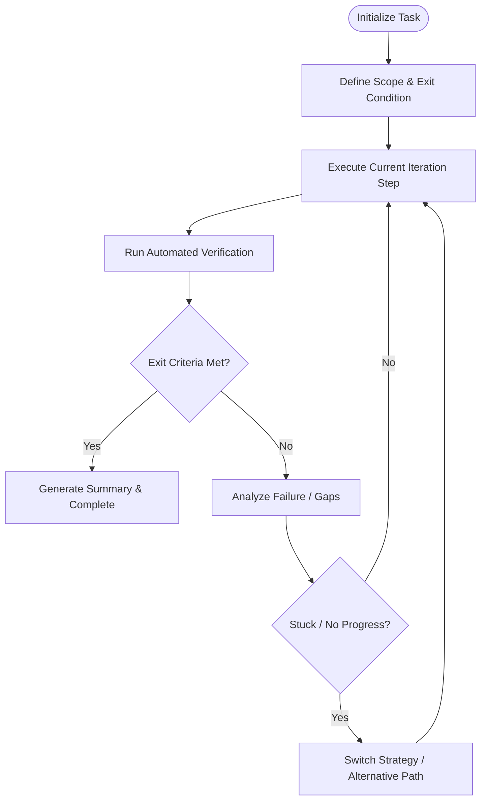

# Ralph Loop — Autonomous Execution Engine

## Iteration Cycle

## Steps

### Step 1: Define the Exit Target
Clearly establish the exit condition:
- Automated tests passing: `pytest ...`
- Frontend build passing: `npm run build`
- Specific functional endpoint behaving as expected

### Step 2: Execute Iteration Step
- Implement the next prioritized change.
- Avoid batching too many unrelated changes in a single iteration.

### Step 3: Verify & Evaluate
- Run the verification command.
- If verified, check if all tasks in scope are complete.
- If incomplete or failing, parse the exact error and formulate the next iteration fix.

### Step 4: Termination
- Once all criteria pass with zero errors, terminate the loop and report final status.
